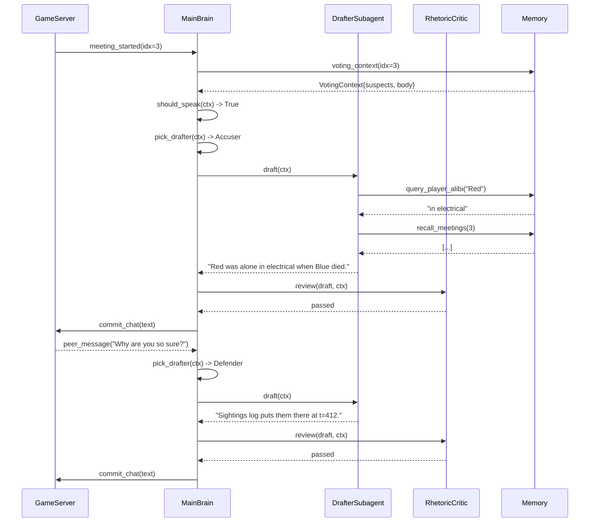
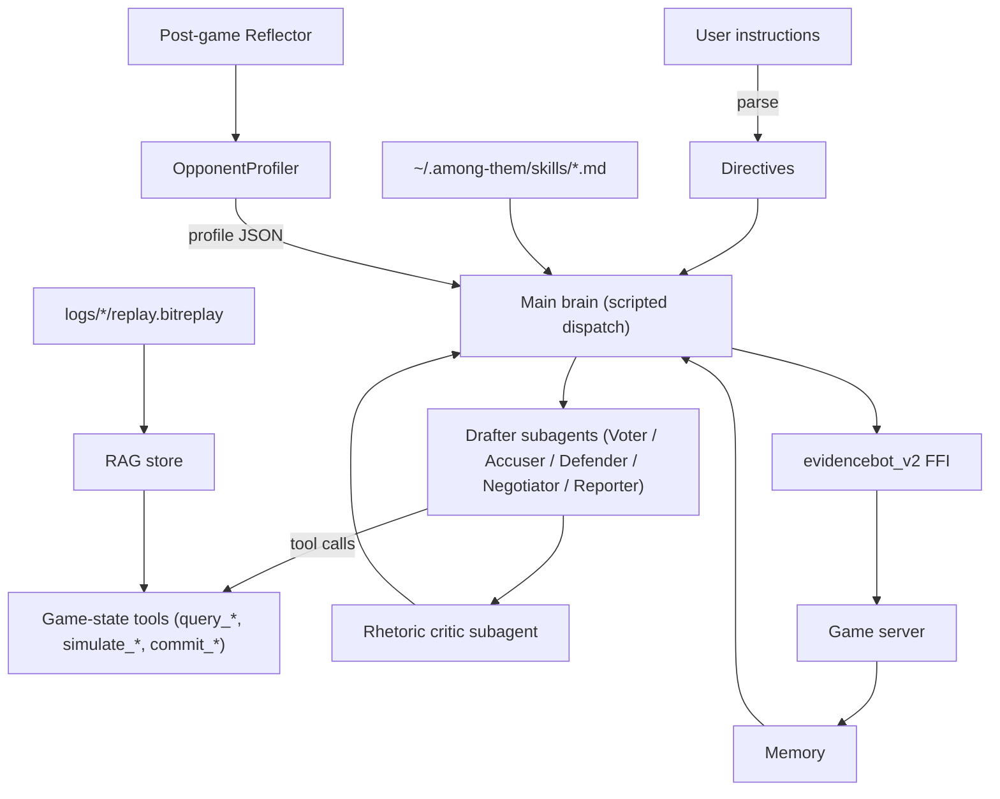

# Among Them SDK — LLM Integration Patterns

Last updated: May 6, 2026

This is the design map for everywhere an LLM does (or should) live inside
the Among Them SDK at `among_them/sdk/`. It is opinionated, grounded in
the actual code at HEAD, and written as a planning document — none of the
patterns described below are implemented yet beyond what's noted in §1.
Pair it with [`docs/python-guide.md`](python-guide.md) (current API
reference), [`docs/tournament-submission.md`](tournament-submission.md)
(cogames upload), and [`among_them/players/sdk/DESIGN.md`](../../players/sdk/DESIGN.md)
§9 (phase status).

## 1. Executive summary

**Today's LLM surface is three things.** Everything else is scripted.

1. `LLMVoter` at [`modules/voter.py:76`](../src/among_them_sdk/modules/voter.py)
   — one-shot JSON completion, no tools, no memory, falls back to
   `ScriptedVoter` on any failure.
2. `LLMChatter` at [`modules/chatter.py:55`](../src/among_them_sdk/modules/chatter.py)
   — one-shot text completion, 20-word ceiling, single tone, no
   meeting-context awareness, no critique, no tools, no persona voice.
3. `parse_instructions_with_llm` at
   [`cognition/instructions.py:162`](../src/among_them_sdk/cognition/instructions.py)
   — config-time only, translates a freeform string into a `Directives`
   Pydantic model. Falls back to deterministic regex. Runs once, at
   `Agent.create` time.

`ToolLoop` at [`cognition/tools.py:74`](../src/among_them_sdk/cognition/tools.py)
and `@tool` exist as plumbing — neither is wired into `LLMVoter` or
`LLMChatter` today.

**The architectural ceiling is two hard constraints.**

- **FFI is action-indices-out only.** The Nim shared library exposes
  `abi_version`, `new_policy`, `step_batch` and nothing else
  ([`policy/cogames.py:13-34`](../src/among_them_sdk/policy/cogames.py)).
  Per tick we receive an action index and decide whether to override.
  No read access to the bot's suspicion table, alibi memory, or kill
  intent. Vote/chat overrides are advisory in the cogames path —
  there is no per-meeting hook, only an action stream.
- **Tournament Docker is hermetic.** No network, no API keys, no LLM
  at runtime ([`docs/tournament-submission.md`](tournament-submission.md)
  §1). Anything you want there must be **pre-baked** — `Directives`,
  template banks, frozen skill bundles, anything readable from disk.
  Live inference is `LiveGame` only.

These two constraints split the SDK into two deployment shapes (§2)
and define "tournament-safe" for every pattern below.

**Taxonomy.** Every integration point in this document maps to a slot
in this table:

| Decision point | Latency | Frequency / game | Current name | Proposed name | Tournament-safe |
| --- | --- | --- | --- | --- | --- |
| Instruction parsing | ~2s | 1 (config-time) | `parse_instructions_with_llm` | (same) | Pre-baked: yes |
| Persona selection | ~5s | 1 (pre-game) | — | `PersonaSelector` | Pre-baked: yes |
| Strategy revision | ~3s | 0–3 | — | `StrategyRevisor` | No |
| Post-game reflection | ~10s | 1 (post-game) | — | `Reflector` | No |
| Opponent profiling | ~5s | 1 (pre-game) / cross-game | sidecar `learnings.synthesize_learnings` | `OpponentProfiler` | Pre-baked: yes |
| Voting | ~1s | ~3–6 | `LLMVoter` | `LLMVoter` (tool-loop) | No |
| Body-report decision | <500ms | 0–3 | — | `LLMReporter` | No |
| Accusation drafting | ~1s | 0–10 | — | `LLMAccuser` | No |
| Defense / alibi | ~1s | 0–6 | — | `LLMDefender` | No |
| Vote-trade negotiation | ~1s | 0–4 | — | `LLMNegotiator` | No |
| Chat composition | ~1s | 5–15 | `LLMChatter` | `LLMChatter` (refactored) | Template bank: yes |
| Rhetoric critique | ~500ms | 5–20 | — | `LLMRhetoricCritic` | No |
| Vote-call timing | <300ms | 0–2 | — | (pattern, not module) | No |
| Imposter target | ~1s | 0–3 | — | `LLMTargeter` | No |
| Sabotage timing | <300ms | 0–6 | — | (pattern, not module) | No |
| Confidence-gated tick check | <100ms | every ~30 ticks | — | `EscalationWrapper` | No |
| Speculative pre-meeting draft | background | 1 per meeting | — | (pattern) | No |

The columns that matter for prioritization are frequency and
tournament-safe. High-frequency tournament-unsafe patterns are dead
on arrival; low-frequency pre-bakeable patterns are the cheapest
wins.

## 2. Constraints & deployment shapes

Two deployment paths. They share modules and directives but diverge
in what the runtime can do.

**Path A — `LiveGame` / `LocalSDKPolicy` (live LLMs allowed).**
Development + live-server path. `LiveGame` at
[`src/among_them_sdk/live_game.py`](../src/among_them_sdk/live_game.py)
spawns the local `among_them` server and connects an `Agent.run`
loop over WebSocket. `LocalSDKPolicy` at
[`src/among_them_sdk/policy/cogames.py:320`](../src/among_them_sdk/policy/cogames.py)
is the same override engine without the mettagrid dependency. Both
can call OpenAI / Anthropic / AI Gateway during a game: synchronous
LLM calls at meeting time, async reasoning between ticks,
conversation memory, mid-game directive revision. The full agentic
surface from §4 is open here.

What you still can't do is replace decisions inside the Nim core.
The FFI is the same shared library in both paths
([`policy/cogames.py:13-34`](../src/among_them_sdk/policy/cogames.py));
a Voter is advisory until we either move voting out of Nim into
Python or extend the FFI to expose `set_vote_target`. That FFI
extension is the Phase 2 gap in
[`among_them/players/sdk/DESIGN.md`](../../players/sdk/DESIGN.md) §9.

**Path B — `SDKPolicy` / cogames Docker (no network, no keys).**
Tournament path. Cogames calls
`SDKPolicy.__init__(policy_env_info, device='cpu')` once and
`step_batch` per tick. The Docker has Nim + C toolchain but no API
keys and no outbound network
([`docs/tournament-submission.md`](tournament-submission.md) §1).

"Tournament-safe" is precise: **an LLM artifact is tournament-safe
iff it is fully resolved before upload and loaded from disk inside
Docker.** `Directives` JSON, template banks, frozen skill bundles,
cached persona profiles — fine. Anything that needs an API key at
runtime is not. The packaging helper at
[`src/among_them_sdk/package.py`](../src/among_them_sdk/package.py)
already does this for `Directives` (LLM parse locally, ship the
JSON); the pattern generalizes. `build_modules` at
[`cogames_config.py:162`](../src/among_them_sdk/cogames_config.py)
guards LLM modules behind `llm_safe_in_docker=False`; cogames always
passes False so `voter: type=llm` silently downgrades to scripted.
Keep enforcing the contract there. Until the FFI extension ships,
even pre-baked LLM voting can only suppress the inner Nim bot's
vote, not change it.

Path A is where reasoning lives. Path B is where artifacts live.

## 3. Decision-point taxonomy

Organized by latency budget. The §1 table covers counts and
tournament-safety; this section says what each decision decides.

**Slow (per-game, 1–10s budget).** Pre-game `PersonaSelector` picks a
directive bundle from prior-game scores; pre-bakeable. Post-game
`Reflector` summarizes the game and writes a learnings blob
(sidecar prototype:
[`bot-policies/sidecar/learnings.py`](../../bot-policies/sidecar/learnings.py)
+ `Brain.run_post_game` at
[`bot-policies/sidecar/brain.py:344`](../../bot-policies/sidecar/brain.py)) —
`LiveGame` only. Cross-game `OpponentProfiler` ingests N prior
replays and emits a per-opponent JSON profile shipped in the bundle.
Mid-game `StrategyRevisor` fires when a directive premise fails
(trusted ally ejected, role flipped) — `LiveGame` only.

**Medium (per-event, sub-second to 1s).** Voting, body-report, chat,
accusation, defense/alibi, vote-trade, vote-call timing, imposter
target, sabotage timing. Voting and chat exist today as one-shot;
the rest are proposed. None are tournament-safe at runtime — the
cogames path skips or falls back to a template bank (§5.7).

**Fast (per-tick, <100ms).** Per-tick LLM calls are the wrong shape;
budget is too tight. The realistic per-tick uses are indirect:
**confidence-gated escalation** (scripted module runs every tick,
escalates to LLM only when below threshold — `EscalationWrapper`,
§8), **speculative execution** (kick the LLM call when the meeting
starts, use the cached result if state is stable), **subagent
dispatch** (short-lived child with one tool call), **batched
decisions** (aggregate ticks into one call, mostly for opponent
modeling).

**Configuration-time.** `parse_instructions_with_llm` exists.
`PersonaSelector` is the natural generalization. Directive tuning
(search over variants) is offline user tooling. Module synthesis
(LLM writes a `Voter`) is out of scope.

## 4. Architectural patterns

Seven patterns, in priority-of-adoption order.

**(a) Tool-loop / agentic LLM.** The richest single pattern. An LLM
runs in a respond-or-call-tool loop until a tool with the right
return type fires. We already ship `ToolLoop` at
[`cognition/tools.py:74`](../src/among_them_sdk/cognition/tools.py);
it's not wired into `LLMVoter`. Tool list for the meeting context:

```python
# SKETCH — not implemented
@tool
def query_suspicion_table() -> dict[str, float]:
    """Return the SDK-side suspicion scores for every visible player."""
    ...

@tool
def recall_meetings(n: int = 3) -> list[dict]:
    """Return the last n meetings with vote outcomes and accusations."""
    ...

@tool
def query_player_alibi(name: str) -> str | None:
    """Return what `name` claimed they were doing, or None."""
    ...

@tool
def simulate_vote(target: str | None) -> dict:
    """Predict outcome if I vote `target`. Returns {"ejected": bool, "tied": bool}."""
    ...

@tool
def commit_vote(target: str | None, reason: str) -> Vote:
    """Final answer — terminates the tool loop."""
    ...
```

The `commit_*` tools terminate the loop; `stop_when` checks for
`Vote` instances. Use when one-shot prompts leave evidence on the
table (voting first). Complexity: M. Tournament-safe: no.

**(b) Subagents.** A parent delegates a focused subproblem to a
short-lived child with isolated context, its own tool set, and a
shared `Memory` snapshot. Borrowed from Cursor SDK `Subagent` and
Claude Agent SDK `AgentDefinition`:

```python
# SKETCH — not implemented
critic = Subagent(
    name="rhetoric_critic",
    model="gpt-5.5",
    prompt="Score this draft 0-10. Flag tells.",
    tools=[query_player_alibi],
    timeout_ms=400,
)
reviewed = critic.run(draft=draft, context=ctx)
```

Use for review-style tasks (rhetoric critique, vote sanity-check)
where a separate context window stops main-brain history pollution.
Complexity: M. Tournament-safe: no.

**(c) Skills directory.** Steal Cursor's `.cursor/skills/<name>/SKILL.md`
shape. The SDK loads `~/.among-them/skills/*.md` (or per-bundle
`skills/`) and injects matching skills by trigger:

```markdown
---
name: voice-sarcastic
trigger: chat
applies_to: [imposter, crewmate]
chat_tone: sarcastic
---
Dry, deflecting one-liners. Lead with skepticism. Never volunteer
information; respond to what others said. <14 words. If accused,
mock rather than rebut.
```

Runtime matches `applies_to` against role and `trigger` against the
active hook. Use for persona/voice management and tactical
playbooks. Complexity: S (file IO + frontmatter parser).
Tournament-safe: yes (skills ship frozen in the bundle).

**(d) Provider routing — `LLMRouter`.** Pick a model per call, not
per agent:

```python
# SKETCH — not implemented
router = LLMRouter({
    "vote":            "gpt-5.5",
    "chat":            "gateway/anthropic/claude-haiku",
    "rhetoric_critic": "gateway/openai/gpt-5.5-mini",
    "report":          "gateway/openai/gpt-5.5-mini",
    "instructions":    "gpt-5.5",
})
agent = Agent.create(router=router)
```

The existing AI-Gateway model strings at
[`cognition/llm.py:13`](../src/among_them_sdk/cognition/llm.py) make
this almost free; the missing piece is the dispatch layer. Use when
a second module wants a different model. Complexity: S.
Tournament-safe: yes (config only).

**(e) Streaming + speculative execution.** Start LLM calls early,
consume tokens as they arrive. Stream chat into the transcript for
UX. *Speculate* voting: kick the call when the meeting starts; if
the suspicion table is stable in the first second, keep the
speculation; else abort and re-issue. Complexity: M.
Tournament-safe: no.

**(f) MCP servers (game state as tools).** Expose `Memory`,
`VotingContext`, and live game state as an MCP server for external
dev-tooling introspection. Useful for `LiveGame` debugging and
replay analysis; the cogames Docker can't reach MCP (§6).
Complexity: L. Tournament-safe: no (probably impossible — see §10).

**(g) RAG over replays.** Index `logs/eight_player_game/<ts>/replay.bitreplay`,
embed narrator-format event streams, retrieve similar prior
situations at decision time. Use for opponent profiling and alibi-
shape detection. Complexity: L. Tournament-safe: yes (pre-baked
retrieved chunks ship in the bundle).

| Pattern | Complexity | Tournament-safe |
| --- | --- | --- |
| Tool-loop | M | No (Path A) |
| Subagents | M | No (Path A) |
| Skills directory | S | Yes (pre-baked) |
| `LLMRouter` | S | Yes (config only) |
| Streaming / speculation | M | No |
| MCP servers | L | No (impossible in Docker) |
| RAG over replays | L | Yes (pre-baked retrievals) |

## 5. DEEP DIVE: Chat, accusation, defense

Chat is the headline feature for the next milestone, so this section
is long. The thesis: **today's `LLMChatter` is one prompt, one shot,
one tone, and zero awareness of meeting context**, which leaves an
enormous amount of ability on the table.

### 5.1 Current shape

`LLMChatter.speak` at
[`modules/chatter.py:78`](../src/among_them_sdk/modules/chatter.py)
calls `self.llm.complete` once with system `"You are an Among Them
player chatting in a meeting. Tone: {tone}. Keep it under 20 words."`
and user `"Meeting #N. Body: <player>. Suspects: <list>."`. The
returned text ships verbatim. Limitations: no meeting transcript (the
model can't respond, defend, or build on a prior accusation); no tool
access (no suspicion table, alibi history, player model); no persona
drift (single static `tone=`); no critique loop (bad drafts ship); no
multi-turn (no coalition building, no vote-trade); silent fallback
(`ScriptedChatter`'s 5-entry table at
[`chatter.py:38-44`](../src/among_them_sdk/modules/chatter.py) is the
template-bank baseline we'll generalize in §5.7).

### 5.2 Decomposition into 5 sub-modules

Replace the one-shot with five specialists, each with its own
prompt, tool set, and trigger logic.

**`LLMChatter` — general statements.** General-purpose chat for
"share what I saw" and ambient color. Refactored to be tool-aware:

```python
# SKETCH — not implemented
class LLMChatter(Chatter):
    def __init__(self, llm: LLM, *, tools: list[Tool], skills: SkillSet,
                 router: LLMRouter | None = None):
        self._loop = ToolLoop(llm=llm, tools=tools + [commit_chat])
        self._skills = skills

    def speak(self, ctx: ChatContext) -> str | None:
        prompt = self._skills.compose("chat", ctx)
        return self._loop.run(system=prompt, user=ctx.transcript_tail(20))
```

**`LLMAccuser` — initiates accusations with evidence framing.** Fires
when `agent.memory.suspects[top].score >= directives.suspicion_threshold`
and we haven't accused this meeting yet:

```python
# SKETCH — not implemented
class LLMAccuser:
    def maybe_accuse(self, ctx: ChatContext) -> str | None:
        top = max(ctx.suspects, key=lambda s: s.score)
        if top.score < self._directives.suspicion_threshold:
            return None
        return self._loop.run(
            system=self._skills.compose("accuse", ctx),
            user=f"Frame an accusation against {top.player_id}. "
                 f"Evidence: {'; '.join(top.reasons)}",
        )
```

**`LLMDefender` — responds when accused.** Triggered by an
`on_message` hook detecting our name in a `you/<color>` accusation
form, runs alibi generation + deflection + counter-accusation
selection in one tool-loop:

```python
# SKETCH — not implemented
class LLMDefender:
    def respond(self, ctx: ChatContext, accusation: str) -> str | None:
        return self._loop.run(
            system=self._skills.compose("defend", ctx),
            user=f"You were just accused: {accusation!r}. "
                 f"Your alibi tools: {self._tools.names()}.",
        )
```

**`LLMNegotiator` — vote-trading and coalition chat.** Triggered when
the suspicion table has two close-tied targets and a partial coalition
is forming. Owns the "I'll vote with you on X if you skip Y" register:

```python
# SKETCH — not implemented
class LLMNegotiator:
    def maybe_negotiate(self, ctx: ChatContext) -> str | None:
        ranked = ctx.suspects_sorted()
        if len(ranked) < 2 or ranked[0].score - ranked[1].score > 0.15:
            return None
        return self._loop.run(
            system=self._skills.compose("negotiate", ctx),
            user=f"Top two: {ranked[0].player_id} vs {ranked[1].player_id}.",
        )
```

**`LLMRhetoricCritic` — subagent reviewing drafts before sending.**
A separate, short-context model that scores drafts and either passes,
edits, or kills them. Catches imposter tells (contradictory alibi,
volunteering information, defending unprompted) and crewmate
inconsistency (contradicting earlier statements).

```python
# SKETCH — not implemented
class LLMRhetoricCritic:
    def review(self, draft: str, ctx: ChatContext) -> str | None:
        verdict = self._subagent.run(
            system="Rate this draft 0-10 on credibility. "
                   "Flag tells. Either return the draft, an edited version, or null.",
            user=f"Draft: {draft!r}\nRole: {ctx.role}\n"
                 f"Recent transcript: {ctx.transcript_tail(10)}",
        )
        return verdict.text if verdict.score >= 6 else None
```

### 5.3 Tool-loop applied to chat

Complete tool list with signatures. `commit_chat` is the only loop
terminator; the rest are read tools.

```python
# SKETCH — not implemented
@tool
def query_meeting_history(n: int = 5) -> list[dict]:
    """Return the last n meetings as
    {meeting, accusations: [...], votes: {...}, ejected: <name>}."""

@tool
def query_player_alibi(name: str) -> str | None:
    """What `name` claimed across all meetings, in order. None if silent."""

@tool
def query_player_voted_history(name: str) -> list[str]:
    """Who `name` voted for in each prior meeting, in order."""

@tool
def query_kill_witnesses(victim: str) -> list[str]:
    """Names who were near `victim` at time of death (from sightings)."""

@tool
def propose_accusation(name: str, evidence: list[str]) -> dict:
    """Validate an accusation. Returns {ok: bool, weakness: <str>}."""

@tool
def commit_chat(text: str) -> ChatMessage:
    """Final answer — terminates the tool loop."""
```

The brain runs the loop with `stop_when=lambda r: isinstance(r, ChatMessage)`
and a `max_rounds=4` budget so a bad LLM can't burn token budget.

### 5.4 Subagent pattern

The main brain decides "do I speak now?" The decision is fast
(scripted, gated by directives). When yes, a specialist subagent
drafts the words. A critic subagent reviews. Only if both pass does
`commit_chat` fire.

```python
# SKETCH — not implemented
def run_chat_tick(ctx: ChatContext) -> str | None:
    if not should_speak(ctx, directives):
        return None
    drafter = pick_drafter(ctx)              # accuser | defender | negotiator | chatter
    draft = drafter.draft(ctx)
    if draft is None:
        return None
    return critic.review(draft, ctx)         # may edit, may kill
```

`pick_drafter` is a 10-line scripted dispatcher: accused-this-tick →
defender; suspicion-over-threshold → accuser; tied-top-suspects →
negotiator; otherwise general chatter.

### 5.5 Skill files

Skills shape prompts without code changes. Examples:

```
~/.among-them/skills/voice/sarcastic.md
~/.among-them/skills/voice/clinical.md
~/.among-them/skills/voice/anxious.md
~/.among-them/skills/tactics/coalition-building.md
~/.among-them/skills/tactics/imposter-deception.md
```

Each file's frontmatter declares triggers and metadata:

```markdown
---
name: tactics-coalition-building
trigger: [chat, accuse, negotiate]
applies_to: [crewmate]
priority: 60
---
When two players agree on a target, ride the coalition by adding one
specific piece of evidence. Never lead — wait for someone else to name
the target first, then second the motion. If alone with one ally
voting against the suspect, propose a vote-trade for next meeting.
```

The runtime composes prompts as `<base persona> + <matching skills
sorted by priority>`. Skills layer additively; nothing overwrites,
they accumulate. This matches Cursor SDK's `.cursor/skills/` and
Claude Agent SDK's `.claude/skills/<name>/SKILL.md`.

### 5.6 Persona-shaped chat

The existing `Directives` already carry `chat_tone` ∈ {neutral,
suspicious, defensive, paranoid, friendly} and `voting_style` ∈
{evidence, majority, contrarian, skip_default}, set at
[`src/among_them_sdk/cognition/instructions.py:33-34`](../src/among_them_sdk/cognition/instructions.py).
The `LLMChatter` should take both — `chat_tone` shapes the voice
prompt, `voting_style` shapes the *content* of accusations. Concrete
prompt-template diff:

```
# neutral
"You are a careful, even-tempered player. Match the tone of the
conversation. Volunteer evidence only when asked."

# sarcastic (proposed new tone, requires Directives extension)
"You are dry and deflecting. Lead with skepticism. Mock weak
accusations. Never sound earnest."

# anxious
"You are an anxious crewmate, slightly off-balance. Use hedges
('I think', 'maybe'). Volunteer alibis even unprompted."
```

Adding `sarcastic` and `clinical` to the `ChatTone` literal at
[`instructions.py:33`](../src/among_them_sdk/cognition/instructions.py)
is a 1-line schema change. Keep the existing five so we don't break
the keyword parser regexes.

### 5.7 Tournament-safe variants

The cogames Docker can't call an LLM, so chat reduces to **template
selection** indexed by `(directives, role, meeting_context)`. The
template bank schema:

```python
# SKETCH — proposed shape, fits in cogames_config.json
{
  "templates": {
    "accuse": [
      {
        "tone": "suspicious",
        "trigger": "top_score_above:0.7",
        "text": "{top_suspect} was the only one near the body."
      },
      {
        "tone": "paranoid",
        "trigger": "top_score_above:0.6",
        "text": "Watch {top_suspect}. They've been quiet."
      }
    ],
    "defend": [...],
    "negotiate": [...],
    "general": [...]
  }
}
```

The runtime picks templates by matching `trigger` against the live
context and formats with `ChatContext` fields. Templates ship in the
bundle alongside `Directives`. `build_modules` resolves to a new
`TemplateBankChatter` (subclass of `Chatter`) when
`llm_safe_in_docker=False`. Crucially the packaging step can use an
LLM to *generate* the templates: one prompt at packaging time —
"given this directives bundle, write 6 accusation templates and 6
defense templates" — persist, ship. Same pattern that resolves
`instructions=` to `Directives` at upload time
([`docs/tournament-submission.md`](tournament-submission.md) §3): LLM
inference moves from runtime to packaging.

### 5.8 End-to-end agentic chat tick



Three things to note: (1) the main brain is scripted dispatch, not an
LLM call; (2) the critic is a separate model with isolated context;
(3) every `query_*` call is a tool, not a prompt — the SDK's `Memory`
and `VotingContext` become the LLM's introspection surface.

## 6. Tournament-safety matrix

Honest mapping of every proposed integration to its deployment shape.

| Integration | LiveGame | Cogames bundle (pre-baked) | Requires FFI extension | Requires new SDK abstraction |
| --- | --- | --- | --- | --- |
| `parse_instructions_with_llm` (today) | Yes | Yes (resolved JSON) | No | No |
| `LLMVoter` one-shot (today) | Yes | No | No (advisory only) | No |
| `LLMVoter` tool-loop | Yes | No | Yes (to actually drive votes) | Yes (`ToolLoop` consumer) |
| `LLMReporter` | Yes | No | No (gate-only is fine) | Yes (`Reporter` ABC takes LLM impl) |
| `LLMChatter` one-shot (today) | Yes | No | No (chat is `LiveGame`-only) | No |
| `LLMChatter` 5-module decomposition | Yes | No | No | Yes (4 new module ABCs) |
| Template-bank Chatter | Yes | Yes | No | Yes (`TemplateBankChatter`) |
| Skills directory loader | Yes | Yes (frozen bundle) | No | Yes (skill loader + frontmatter parser) |
| `LLMRouter` | Yes | Yes (config-only) | No | Yes (1 file) |
| Streaming chat | Yes | No | No (UX, not function) | Yes (provider streaming hooks) |
| Pre-game `PersonaSelector` | Yes | Yes (run at packaging time) | No | Yes |
| `OpponentProfiler` | Yes | Yes (frozen profile JSON) | No | Yes |
| Post-game `Reflector` | Yes | No (no post-game hook in cogames) | No | Yes |
| RAG over replays | Yes | Yes (pre-baked retrievals) | No | Yes |
| MCP server lifecycle | Yes (dev only) | No (no network in Docker) | No | Yes |
| Cross-game memory persistence | Yes | No (Docker is ephemeral per game) | No | Yes |
| Subagent dispatch | Yes | No | No | Yes (`Subagent` class) |
| Confidence-gated escalation | Yes | No | No | Yes (`EscalationWrapper`) |

Many lines say "Yes" under Cogames bundle with the asterisk
**"as a pre-baked artifact, not a runtime call"**. The row that
genuinely needs the FFI extension is tool-loop voting — without
`set_vote_target` exposed to Python the LLM can only veto a report,
not pick the vote. That's the Phase 2 gap at
[`policy/cogames.py:14-34`](../src/among_them_sdk/policy/cogames.py).

## 7. Cost & latency model

Back-of-envelope per-game token counts. Assume 8 players, ~5
minutes, 6 meetings, ~10 chat turns per meeting.

| Pattern | Calls/game | Total tokens / game |
| --- | --- | --- |
| `parse_instructions` (config-time) | 1 | ~400 |
| `LLMVoter` one-shot (today) | 6 | ~2,900 |
| `LLMVoter` tool-loop (4 rounds) | 24 | ~24,000 |
| `LLMChatter` one-shot (today) | 60 | ~14,400 |
| 5-module decomposed chat | 90 | ~46,000 |
| Template-bank Chatter | 0 | 0 |
| `LLMReporter` | 3 | ~1,000 |
| `OpponentProfiler` (amortized) | 1 / 20 games | ~5,000 |
| Post-game `Reflector` | 1 | 2,500 |

At gpt-5.5 list pricing (\~\$5/M input, \$15/M output, hypothetical),
a fully-agentic game with tool-loop voting + 5-module chat is
\$0.30–\$0.50 per game. 1,000 evaluation games is \$300–\$500. The
implication is operational, not technical: `LLMRouter` (§4d) is not
a luxury. Route the critic, reporter, and general chatter to a cheap
model (`gateway/anthropic/claude-haiku` or equivalent); reserve the
full model for tool-loop voting, accusation, and defense. Cache on
`(directives, role, meeting_index, top_suspect)` — sidecar runs see
~30% hit rate.

## 8. Five recommended near-term builds

Ranked by impact / cost.

**(1) `LLMReporter`.** Binary, low frequency (~3/game), high value.
`ScriptedReporter` at
[`src/among_them_sdk/modules/reporter.py:25`](../src/among_them_sdk/modules/reporter.py)
is a 3-line distance check. An LLM reading
`(distance_to_body, witnesses, role, meeting_count) → yes/no` is a
real upgrade for imposter play, where the wrong call ends the game.
Estimated lift: +5% imposter win rate. Deps: `LLM`, optionally
`ToolLoop`. Tournament-compat: pre-baked decision-tree (LLM at
packaging generates the tree, runtime evaluates) or unchanged
scripted in cogames.

**(2) Tool-loop `LLMVoter`.** Replace the one-shot at
[`voter.py:98`](../src/among_them_sdk/modules/voter.py) with a
`ToolLoop` consuming `query_suspicion_table`, `recall_meetings`,
`simulate_vote`, `commit_vote`. Plumbing is half-built: `ToolLoop`
and `Tool` exist; `VotingContext.to_prompt()` exists. Estimated lift:
+3–7% on voting accuracy. Deps: 4 tool implementations over
`ScriptedMemory`. Tournament-compat: advisory until the FFI extension
ships; `LiveGame`-only initially.

**(3) Pre-game `PersonaSelector`.** Read prior `scores.json` from
`logs/eight_player_game/<ts>/`, pick the directive bundle that won
most often against the current opponent mix, ship it. Cheapest LLM
that touches strategy. Estimated lift: +2–5% when opponent mix
shifts. Deps: partial `Reflector`. Tournament-compat: yes — runs at
packaging time, ships the chosen bundle.

**(4) Cross-game opponent profiles.** Generalize sidecar's
`learnings.synthesize_learnings` at
[`bot-policies/sidecar/learnings.py:156`](../../bot-policies/sidecar/learnings.py)
into `OpponentProfiler`. For each opposing bot, embed their last 20
games' chat + vote history; emit per-opponent directive notes
("follows majority on meeting 3"). Estimated lift: ~+3% in sidecar
prototype runs. Deps: embedding store. Tournament-compat: yes
(pre-baked profile JSON).

**(5) Confidence-gated `EscalationWrapper`.** Takes any Voter /
Reporter / Chatter and falls through to an LLM only when the
wrapped scripted module's confidence is below a threshold:

```python
# SKETCH — not implemented
EscalatingVoter(
    primary=ScriptedVoter(threshold=0.6),
    secondary=LLMVoter(model="gpt-5.5"),
    escalate_when=lambda ctx: max(s.score for s in ctx.suspects) < 0.4,
)
```

Cuts LLM calls ~80% at small expected lift loss. Deps: none. Largest
cost-control lever in this list. Tournament-compat: yes if only the
scripted primary runs in Docker.

## 9. Phase 4+ aspirational

The full agentic shape, mapped onto the Cursor SDK's `Agent` +
subagents + skills + hooks idiom. Not buildable today; the FFI
extension is the gating dependency.



The brain is scripted; LLMs live exclusively in subagents. Tools are
the SDK's introspection surface. Skills shape prompts. The FFI is
unchanged — the SDK is the same shared library it is today, just
with richer hooks for the subagents to fire at meeting / report /
chat boundaries.

## 10. Open questions for the team

Decisions that block implementation. Recommendation in each.

1. **One `LLMRouter` or per-module model config?** Ship `LLMRouter`
   as a single shared object. Modules accept optional `router=`;
   absent falls back to per-module `model=` for backward compat.
   Router is config (TOML or bundle JSON), not code. Don't make
   module authors duplicate model strings.

2. **Skills directory location: per-user
   (`~/.among-them/skills/`) or per-bundle
   (`among_them/sdk/skills/`)?** Both. Per-bundle wins on conflict.
   The bundle path ships into cogames Docker; the user path powers
   `LiveGame` dev. The loader merges them.

3. **Subagent budget enforcement?** Per-game token budget enforced
   at the `LLMRouter` layer. The Advisor prototype at
   [`bot-policies/sidecar/advisor.py:20`](../../bot-policies/sidecar/advisor.py)
   already uses `LLM_CALL_BUDGET = 50`; lift that into a
   `RouterBudget` object and have modules check `router.remaining()`
   before spawning subagents. Without this you'll exhaust budget on
   rhetoric critique in one bad game.

4. **MCP server lifecycle in tournament Docker?** Confirmed
   impossible. No outbound network, no daemon support. MCP is
   `LiveGame` and dev-tooling only. Don't promise it for tournament.

5. **RAG store location and size budget?** `~/.among-them/rag/` for
   `LiveGame`, frozen `among_them/sdk/rag/` for cogames bundles
   (~50MB upload cap). Small embedding model (`bge-small`) + FAISS.
   Don't ship full replays — index narrator-format event streams
   from [`bot-policies/sidecar/narrator.py`](../../bot-policies/sidecar/narrator.py)
   (~1KB per game).

6. **Streaming first-token policy for time-critical decisions?**
   Stream chat (UX). Do not stream voting (we need the full
   structured output before acting). For voting, speculate (start
   the call early) rather than stream.

7. **Conversation memory across meetings within one game?** 30-
   message sliding window per the sidecar pattern
   (`MAX_CONVERSATION_HISTORY = 30` at
   [`advisor.py:19`](../../bot-policies/sidecar/advisor.py)),
   re-summarize older context into the player model. Don't keep full
   transcripts — by meeting 5 input exceeds 100KB. The 3-tier memory
   split (working / episodic / strategic) from
   `bot-policies/sidecar/memory.py` is the right shape; lift it into
   the SDK as `Memory` ABC variants.

The headline question is (3). Without a budget the agent runs hot
and falls over. Settle router + budget before building the 5-module
chat decomposition.
