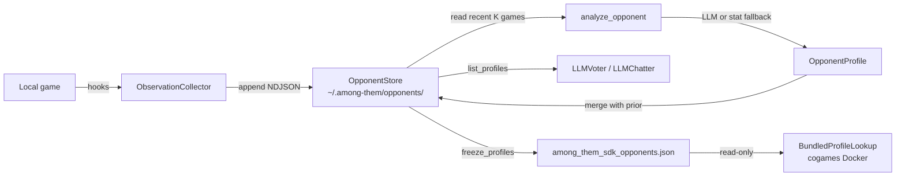

# Cross-game opponent modeling

> "I just played five games against `nottoodumb3` and they always
> bandwagon onto the first accusation in meeting 1. Why am I not using
> that?"

The Among Them SDK now has a first-class answer: capture every observed
action of every named opponent across games, persist it to disk,
analyze it (with an LLM if available, otherwise a deterministic
fallback), and inject the resulting profile into your `LLMVoter` and
`LLMChatter` at decision time.

The pipeline is intentionally narrow: one new package
(`among_them_sdk.opponents`), one optional kwarg on the existing LLM
modules, and one packaging flag for tournament play. No refactor of the
runtime layer; no new LLM provider.

## Architecture



Three things to read before extending:

* [`models.py`](../src/among_them_sdk/opponents/models.py) — the schema.
* [`collector.py`](../src/among_them_sdk/opponents/collector.py) —
  hook-payload conventions; tolerant of missing keys.
* [`analyzer.py`](../src/among_them_sdk/opponents/analyzer.py) —
  deterministic-fallback logic mirrors the LLM prompt's schema.

## Quickstart

```bash
cd among_them/sdk

# 1. Run the demo loop. Plays 3 simulated games and walks the full
#    capture → analyze → consume → snapshot pipeline.
uv run python examples/opponent_learning_loop.py --games 3 \
  --no-llm \
  --store-root ~/.among-them/opponents \
  --keep-store

# 2. Inspect what got recorded.
uv run python -m among_them_sdk.opponents list
uv run python -m among_them_sdk.opponents show nottoodumb3 --summary

# 3. Refresh every profile (LLM if API key is set, fallback otherwise).
uv run python -m among_them_sdk.opponents analyze-all --llm

# 4. Freeze for tournament use.
uv run python -m among_them_sdk.opponents freeze \
  --output among_them/sdk/src/among_them_sdk/policy/among_them_sdk_opponents.json
```

That's it. From this point on, any `Agent.create(...)` will pick up
the profiles automatically and `LLMVoter` / `LLMChatter` will see a
compact intel summary in their LLM prompts.

## Wiring observation capture into a real game

```python
from among_them_sdk import (
    Agent,
    LLMVoter,
    ObservationCollector,
    OpponentStore,
)

store = OpponentStore()  # ~/.among-them/opponents/ by default
collector = ObservationCollector(
    store=store,
    game_id="2026-05-06-evening",
    self_id="sdkbot",
    known_opponents=["nottoodumb1", "nottoodumb2", "...", "sdkbot"],
)

agent = Agent.create(
    voter=LLMVoter(),
    hooks=collector.hooks,            # <- the wiring point
)

# ... play a game ...

# After the game ends, stamp role + alive info from server scores.json:
collector.flush_game_end(
    roles={"nottoodumb1": "imposter", "nottoodumb2": "crew", ...},
    alive_at_end={"nottoodumb1", "nottoodumb3"},
)
```

`Agent.create` also exposes:

* `opponent_profiles=mapping` — pass an explicit profile mapping that
  overrides the auto-load from disk (useful for tests + bundle path).
* `load_opponent_profiles=False` — skip the auto-load entirely.

When the agent constructs `LLMVoter` or `LLMChatter` (either by default
or because you passed instances without their own
`opponent_profiles=`), the agent injects its loaded profile mapping so
the LLM prompts include compact intel like:

```
nottoodumb3 (n=4, conf=0.62); votes: bandwagoner (skip=10%, maj=80%);
chat: defensive,suspicious (rate=70%); accuses sdkbot,nottoodumb1
```

The summary is bounded to ~360 chars per opponent, so injecting six
profiles costs roughly 2 KB of extra context.

## The schema

`OpponentProfile` is the analyzed output. Sub-profile models
(`ChatStyleProfile`, `VoteStrategyProfile`, `AccusationProfile`,
`DefenseProfile`, `ConditionalBehavior`) are typed Pydantic v2 models
— never freeform dicts. The LLM prompt asks for exactly this shape so
parsing is trivial. See
[`models.py`](../src/among_them_sdk/opponents/models.py) for fields and
constraints.

`OpponentProfile.compact_summary(max_chars=360)` is the single-paragraph
intel string consumed by `LLMVoter` / `LLMChatter`.

## Storage layout

By default everything lives at `~/.among-them/opponents/`:

```
~/.among-them/opponents/
├── nottoodumb1/
│   ├── observations.ndjson    # one ObservationEvent per line, append-only
│   └── profile.json           # latest analyzed OpponentProfile
├── nottoodumb2/
│   ├── observations.ndjson
│   └── profile.json
└── ...
```

Override the root in three ways:

* `OpponentStore(root=...)` constructor arg
* `AMONG_THEM_OPPONENTS_DIR` env var
* `--store-root` CLI flag

NDJSON is intentional: text-friendly, greppable, diffable. If you want
a per-project dossier (e.g. you're benching a single tournament
opponent), point your store root at a folder inside the repo and check
it in.

## The analyzer

`analyze_opponent(name, store, *, use_llm=True, recent_games=10)` is
the entry point. It always returns a valid `OpponentProfile` even with
zero observations. Two paths:

1. **LLM path.** When `use_llm=True` and an API key is set
   (`OPENAI_API_KEY`, `ANTHROPIC_API_KEY`, or `AI_GATEWAY_API_KEY`),
   the analyzer renders the recent observations as a compact event log
   and asks the model to emit a strict JSON `OpponentProfile`. The
   prompt and parser live in
   [`analyzer.py`](../src/among_them_sdk/opponents/analyzer.py).
   Confidence is bounded to ≤ 0.95 so a few observations don't claim
   1.0.
2. **Deterministic fallback.** When no API key is available — or the
   user passes `--no-llm` / `use_llm=False` — the analyzer counts:
   chat rate, skip rate, follow-majority rate, accusation frequency,
   defensive-keyword density, role-conditional kills. Confidence is
   capped at **0.3** so a later LLM-derived profile out-ranks it on
   merge.

Both paths produce the **same model**. Consumers don't branch on which
path emitted it.

After analyzing, `analyze_opponent` calls `merge_profiles(prior,
fresh)`:

* Game count: `max(prior, fresh)` (monotonic).
* Numeric fields (rates, scores): confidence-weighted blend.
* Lists (tone descriptors, common phrases, accusation targets):
  union, prior first, capped to a sane max length.
* `freeform_notes`: prior's notes are preserved with a
  `[prior @ <timestamp>]` divider so history is auditable.
* `confidence`: `max(prior, fresh) + 0.02` bounded by 0.99.

So profiles **improve over time**, never regress.

## Tournament workflow

Cogames runs the SDK policy inside a Docker validator with no network
and no API keys (see
[`policy/cogames.py`](../src/among_them_sdk/policy/cogames.py)). That
means the live `OpponentStore` — which can call an LLM and reads from
your home directory — must never be touched at tournament time.

The packaging CLI handles this for you:

```bash
cd among_them/sdk
python -m among_them_sdk.package \
    --from-agent examples/personas.py:_build_aggressive \
    --profiles-from ~/.among-them/opponents \
    --policy-name "$USER-sdk-with-intel"
```

The `--profiles-from` flag does three things:

1. Reads every profile in your local store.
2. Calls `freeze_profiles(...)` to write a static JSON snapshot at
   `among_them/sdk/src/among_them_sdk/policy/among_them_sdk_opponents.json`
   (override with `--profiles-out`).
3. Adds the snapshot path to the printed `cogames upload -f ...`
   command so the validator includes it in the bundle.

At tournament runtime, the SDK policy can load the snapshot via
`BundledProfileLookup.from_path(...)` and pass it as
`opponent_profiles=` to the modules — no network, no LLM, no risk of
the validator failing to find an API key.

`BundledProfileLookup` is a read-only `Mapping[str, OpponentProfile]`,
so consumers don't special-case bundle vs. live store: they take
either.

## CLI

```
python -m among_them_sdk.opponents [--store-root PATH] <subcommand>
```

| Subcommand | Purpose |
|---|---|
| `record` | Print store dir + per-opponent observation counts. Sanity check. |
| `list` | Tabular list of opponents, games observed, last update, vote label. |
| `show NAME [--summary]` | Pretty-print one profile (full JSON or one-line summary). |
| `analyze NAME [--llm]` | Force a fresh analysis and persist. |
| `analyze-all [--llm]` | Refresh every known opponent. |
| `freeze --output PATH` | Write a tournament-safe snapshot. |

When `--llm` is requested but no API key is set, the CLI logs a warning
and falls back to the deterministic analyzer.

## Privacy + hygiene

These structures store opponent player names verbatim and chat
messages verbatim. The store lives on disk by default. **Do not point
the store at a public directory if your local games involve real
human handles you don't want recorded.** The default
`~/.among-them/opponents/` is per-user but not encrypted.

If you want a per-project dossier instead of a machine-wide one, set
`AMONG_THEM_OPPONENTS_DIR=$PWD/.among-them` and add `.among-them/` to
your project's `.gitignore`.

For tournaments, the snapshot you ship via `--profiles-from` *will*
contain whichever opponent names + chat snippets are in your store at
freeze time. Use `analyze-all` after sanitizing if needed; the freeze
step copies whatever profiles exist.

## Limitations

**Small-sample variance.** With only one or two games, the
deterministic-fallback labels can be misleading. Confidence is capped
at 0.3 so the consumer modules know to treat the intel softly. The
LLM path widens that band but is bounded to 0.95 + 0.05·(games-1) and
never goes to 1.0.

**Drift if opponents change.** If `nottoodumb3` is replaced by a
different model under the same name, the profile won't notice — the
merge step preserves prior notes and compounds confidence. Workarounds:
delete the opponent's folder before the new run, or use
`OpponentStore.prune_old(max_games_per_opponent=K)` to bound history.

**The deterministic fallback is shallower.** It can't read tone or
detect bluffs; it counts. The fallback's `confidence ≤ 0.3` bound
exists precisely so the LLM path overwrites it cleanly when it
becomes available.

**Hook payload coverage.** `LiveGame` only fires `on_message` for chats
the SDK player itself sent (the per-player WebSocket doesn't surface
opponents' chats with author IDs). The collector tolerates that —
events are silently no-op'd when fields are missing — but if you want
full coverage of opponent chat in real local games today, you need
either: (a) a `/global` admin socket subscription (Phase 4 in
[DESIGN.md](../../players/sdk/DESIGN.md)), or (b) per-opponent log
parsing as the
[`opponent_learning_loop`](../examples/opponent_learning_loop.py)
example demonstrates with `--mode real`.

**Vote targets in real local games.** The local server's
`scores.json` doesn't include per-vote targets. Until that's added
(and the server begins emitting structured event packs), the
`real`-mode example records only what's in the per-bot stdout logs +
post-game role/alive info. Simulated mode is fully covered.

## See also

* [DESIGN.md §Phase 4](../../players/sdk/DESIGN.md) — the planned
  `/global` subscription that would let the collector see all
  opponent chats / votes / kills directly.
* [`docs/llm-integration.md`](llm-integration.md) — how the LLM
  abstraction handles graceful degradation, which the analyzer
  inherits.
* [`docs/tournament-submission.md`](tournament-submission.md) — full
  packaging happy path.
