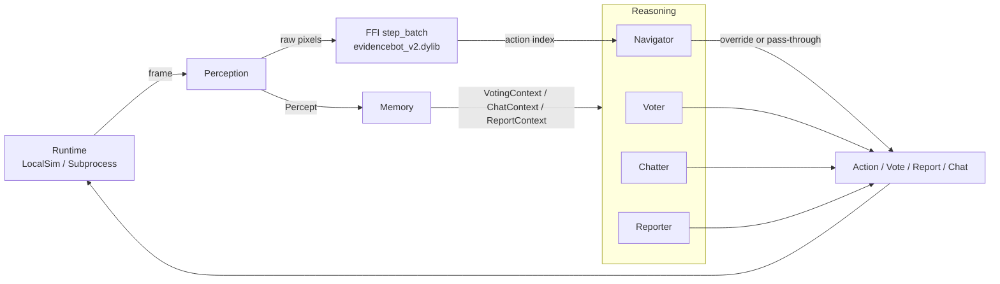

# Among Them SDK — Python Usage Guide

## 1. What this guide covers

This is the deeper walkthrough for the Among Them SDK at `among_them/sdk/`. By the end you should be able to install the SDK, run the default `evidencebot_v2` agent, steer it with natural-language instructions, swap any of its six cognitive modules, choose a runtime, register hooks, and ship your own profile. The [README](../README.md) is the elevator pitch and 5-line hello world; this guide assumes you've skimmed it. Every example is verified against the actual Phase 0 + Phase 1 API in `src/among_them_sdk/`; design-doc features that haven't shipped yet are flagged inline.

## 2. Prerequisites & install

- **Python ≥ 3.11** (per `pyproject.toml`). The SDK uses `tomllib` and PEP 604 generics.
- **Nim 2.2.4** on `PATH` plus a C toolchain (clang/gcc/msvc). Nim is the only mandatory native dep — there is no pure-Python fallback in this milestone (DESIGN.md §9).
- **Among Them monorepo** checked out. The FFI loader (`src/among_them_sdk/ffi.py`) walks up to `among_them/players/` from the SDK source. Override with `AMONG_THEM_PLAYERS_DIR=/abs/path`.

```bash
cd among_them/sdk
uv sync                       # creates .venv, installs runtime + dev deps
# or:
pip install -e '.[test]'      # editable install with pytest extras
```

On first load the SDK shells out to `among_them/players/build_evidencebot_v2.py` to produce `libevidencebot_v2.{dylib,so,dll}` next to the build script (picked up via `ffi.library_path()`). To pre-build:

```bash
python among_them/players/build_evidencebot_v2.py
```

Optional extras declared in `pyproject.toml`: `[openai]` (`openai>=1.40`), `[anthropic]` (`anthropic>=0.30`), `[test]` (pytest), and `[all]` (both LLM SDKs). Install with `pip install -e '.[openai,anthropic]'` or `uv sync --extra all`.

## 3. Your first bot (60 seconds)

A slightly chattier `examples/hello.py`:

```python
from among_them_sdk import Agent, LocalSim

agent = Agent.create()                                  # FFI + scripted modules
sim = LocalSim(ticks_per_round=60, meeting_every=20)    # explicit runtime
result = agent.run(rounds=1, runtime=sim)

print(result.summary)
print('actions seen:', set(result.actions))
print('meetings/votes/chats:',
      result.meetings, len(result.votes), len(result.chat_messages))
print('directives:', result.raw['directives'])
```

What happens:

1. `Agent.create()` resolves config (env + `among-them.toml`), parses an empty `instructions=` into default `Directives`, instantiates the six scripted modules, and loads the FFI singleton (auto-building the `.dylib` if needed).
2. `LocalSim` synthesises frames and fires meetings/bodies on a fixed cadence so your modules actually get called.
3. `agent.run` walks the tick loop, calls `policy.step_with_hooks` per frame, and returns a `RunResult` (see `runtime.py`) with `ticks`, `actions`, `meetings`, `votes`, `reports`, `chat_messages`, `summary`, and a `raw` dict containing `policy_summary`, `directives`, and `cyborg` status.

## 4. Anatomy of an Agent



**Per stage** (cross-reference `src/among_them_sdk/agent.py`):

- **Runtime** produces a `Frame` per tick. `LocalSim._make_frame` synthesises a `(1, 1, 128, 128)` uint8 buffer; `Subprocess` is a smoke-test stub today (see §7).
- **Perception** turns the frame into a `Percept`. The default `ScriptedPerception` is a passthrough — Nim's localizer is intentionally not re-implemented in Python.
- **Memory** maintains the suspicion table behind `VotingContext`. `ScriptedMemory` is a flat dict of `SuspicionEntry`; the FFI keeps its own richer table internally that the SDK cannot read.
- **Reasoning modules** fire at meeting/report/chat time. `Voter.vote(ctx) -> Vote`, `Reporter.should_report(ctx) -> bool`, `Chatter.speak(ctx) -> str | None`, `Navigator.step(ctx) -> int | None` (return `None` to keep the FFI action).
- **FFI step_batch** is the action floor: pixels in → action index out, every tick. Module overrides run *above* the FFI (DESIGN.md §9).

Override any stage by passing `perception=`, `memory=`, `voter=`, `navigator=`, `chatter=`, or `reporter=` to `Agent.create`.

## 5. Steering with `instructions=`

Three flavours:

```python
from among_them_sdk import Agent

aggressive = Agent.create(
    instructions=(
        'Report bodies aggressively. Trust no one after meeting 2. '
        'Vote with the majority unless you have direct evidence.'
    ),
    use_llm_for_instructions=False,   # hermetic for examples
)

paranoid = Agent.create(
    instructions='Be paranoid. Avoid the central room. Skip votes without evidence.',
    use_llm_for_instructions=False,
)

social = Agent.create(
    instructions='Be friendly. Trust everyone. Only report if you saw the kill.',
    use_llm_for_instructions=False,
)
```

Each string is parsed at `Agent.create` time into a `Directives` Pydantic model (`cognition/instructions.py`). When an API key is present and `use_llm_for_instructions=True`, the SDK calls a small `gpt-5.5` translation prompt that returns strict JSON. Otherwise — including any LLM failure — it falls back to `parse_instructions_keyword`, a deterministic regex parser. Both paths return the same model.

The `aggressive` example above parses (under the keyword path) to:

```json
{
  "suspicion_threshold": 0.8,
  "report_eagerness": "high",
  "kill_eagerness": "normal",
  "chat_tone": "neutral",
  "voting_style": "majority",
  "trust_horizon_meetings": 2,
  "avoid_central_room": false,
  "follow_majority": true,
  "raw": "Report bodies aggressively. Trust no one after meeting 2. ...",
  "notes": ["matched: \\b(report|reporting)[^.]*\\b(aggressiv...", ...]
}
```

Inspect at runtime with:

```python
print(aggressive.directives.model_dump_json(indent=2))
```

If you want determinism without an LLM round-trip but with structured input, pass `cognitive=` directly. It overrides the parsed directives field-by-field via `Directives.merged_with`:

```python
agent = Agent.create(
    cognitive={
        'suspicion_threshold': 0.7,
        'report_eagerness': 'high',
        'voting_style': 'majority',
        'follow_majority': True,
        'chat_tone': 'suspicious',
    },
)
```

Valid keys live in `Directives`: `suspicion_threshold`, `report_eagerness`, `kill_eagerness`, `chat_tone`, `voting_style`, `trust_horizon_meetings`, `avoid_central_room`, `follow_majority`.

## 6. Swapping cognitive modules

| Slot | Default (scripted) | LLM-backed variant | Source |
| --- | --- | --- | --- |
| `voter` | `ScriptedVoter` | `LLMVoter` | `modules/voter.py` |
| `chatter` | `ScriptedChatter` (also `SilentChatter`) | `LLMChatter` | `modules/chatter.py` |
| `reporter` | `ScriptedReporter` | *not exposed yet — tracked in DESIGN.md §9 (Phase 2)* | `modules/reporter.py` |
| `navigator` | `ScriptedNavigator` | *not exposed yet — extend `Navigator` directly* | `modules/navigator.py` |
| `perception` | `ScriptedPerception` | *not exposed yet — extend `Perception` directly* | `modules/perception.py` |
| `memory` | `ScriptedMemory` | *not exposed yet — extend `Memory` directly* | `modules/memory.py` |

### (a) Drop in `LLMVoter`, leave the rest scripted

```python
from among_them_sdk import Agent, LLMVoter

agent = Agent.create(voter=LLMVoter(model='gpt-5.5'))
result = agent.run(rounds=1)
```

When to reach for it: LLM-quality vote justifications, cheap navigation. Cost: one chat completion per meeting (~6 per 5-min game). Latency: the meeting tick blocks on the LLM call. `LLMVoter` falls back to `ScriptedVoter` automatically if the key is missing or the call raises.

### (b) Custom Python voter

Implement the `Voter` ABC from `modules/voter.py` (one method, `vote(ctx) -> Vote`):

```python
from among_them_sdk import Agent, Vote, Voter, VotingContext

class GrudgeVoter(Voter):
    def vote(self, ctx: VotingContext) -> Vote:
        if not ctx.suspects:
            return Vote.skip('no suspects yet')
        top = max(ctx.suspects, key=lambda s: s.score)
        if top.score < 0.3:
            return Vote.skip(f'low confidence ({top.score:.2f})')
        return Vote(target=top.player_id, reason=f'grudge ({top.score:.2f})')

agent = Agent.create(voter=GrudgeVoter(), use_llm_for_instructions=False)
```

When to reach for it: deterministic, zero-LLM, unit-testable. Same shape applies to `Chatter`, `Reporter`, and `Navigator` — one method, one return value.

### (c) Mixing two modules

```python
from among_them_sdk import Agent, LLMChatter, Reporter
from among_them_sdk.modules.reporter import ReportContext

class CautiousReporter(Reporter):
    def should_report(self, ctx: ReportContext) -> bool:
        return ctx.distance_to_body is not None and ctx.distance_to_body <= 2

agent = Agent.create(
    chatter=LLMChatter(model='gpt-5.5', tone='suspicious'),
    reporter=CautiousReporter(),
)
```

Typical real-world shape: LLM chat for personality, scripted/custom reporter for safety, default voter and navigator for cost. Modules are independent — no shared state to wire.

## 7. Choosing a runtime

```python
from among_them_sdk import Agent, LocalSim, Subprocess

agent = Agent.create()
result = agent.run(rounds=2, runtime=LocalSim(ticks_per_round=120, seed=7))
```

- **`LocalSim` (default).** In-process, fast, deterministic via `seed`. Knobs: `ticks_per_round`, `meeting_every`, `report_every`, `n_players`, `noisy_frames`. Use it for unit tests, A/B comparisons, and bulk trials.
- **`Subprocess`.** Today only exposes `run_default_subprocess()`, which shells out to `build_evidencebot_v2.py` as a toolchain smoke test. Full streaming game runs arrive with Phase 4.
- **`RemoteServer`.** Construction raises `NotImplementedError`. Don't pick it; track Phase 4 in DESIGN.md §8.

If you omit `runtime=`, `agent.run` builds a default `LocalSim()` for you.

## 8. Hooks

`AgentHooks` (`hooks.py`) is a dataclass of optional callables. Each is invoked from the runtime tick loop and any exception they raise is logged + swallowed.

| Hook | Signature | Fired by `agent.run` today? |
| --- | --- | --- |
| `pre_tick` | `(ctx: dict)` | yes |
| `post_tick` | `(ctx: dict, action: int)` | yes |
| `on_meeting` | `(ctx: dict)` | yes (twice — once on entry, once before vote) |
| `on_vote` | `(ctx: dict)` | yes |
| `on_message` | `(ctx: dict)` | yes (only when chatter emits text) |
| `on_kill` | `(ctx: dict)` | declared, **not fired yet** — Phase 2 will route kill events through it |
| `on_llm_call` | `(ctx: dict)` | declared, **not fired yet** — modules call LLMs directly today |
| `custom[name]` | `(*args, **kwargs)` | only when you call `agent.hooks.call('name', ...)` yourself |

Worked example — log every vote to stdout:

```python
from among_them_sdk import Agent, AgentHooks

def log_vote(ctx):
    print(f'[meeting {ctx["meeting"]}] -> {ctx["target"]!r}  ({ctx["reason"]})')

agent = Agent.create(
    hooks=AgentHooks(on_vote=log_vote),
    use_llm_for_instructions=False,
)
agent.run(rounds=1)
```

## 9. LLM providers & secrets

`among_them_sdk.cognition.llm.LLM` parses model strings like an AI Gateway:

- `'gpt-5.5'` or `'gpt-4o-mini'` → OpenAI (uses `OPENAI_API_KEY`).
- `'openai/gpt-5.5'` → explicit OpenAI.
- `'anthropic/claude-3-5-sonnet'` → Anthropic (uses `ANTHROPIC_API_KEY`).
- `'gateway/openai/gpt-5.5'` → Vercel AI Gateway (uses `AI_GATEWAY_API_KEY` and optional `AI_GATEWAY_BASE_URL`, defaults to `https://ai-gateway.vercel.sh/v1`).

Switch provider per module:

```python
from among_them_sdk import Agent, LLMChatter, LLMVoter

agent = Agent.create(
    voter=LLMVoter(model='anthropic/claude-3-5-sonnet'),
    chatter=LLMChatter(model='gateway/openai/gpt-5.5', tone='friendly'),
)
```

`LLM(...)` raises `LLMUnavailableError` if the matching key isn't set; `LLMVoter` / `LLMChatter` catch it during `__init__` and fall back to their scripted counterparts. `cognition.llm.safe_llm(model)` is the LLM-or-None helper for your own modules.

`among-them.toml` (loaded from CWD) layers config above env and below kwargs. Keys recognised by `config.py`:

```toml
[agent]
profile = 'evidencebot_v2'

[runtime]
default = 'local-sim'

[tracing]
backend = 'structlog'
```

The loader also reads env vars prefixed `AMONG_THEM_` (e.g. `AMONG_THEM_PROFILE`) and **rejects** TOML keys ending in `_API_KEY` to discourage committing secrets — keep keys in env.

## 10. Tracing & debugging

The default backend is `structlog` JSONL on stdout (see `tracing.py`). Every `Agent.create` and tick emits an event:

```python
import logging, structlog
logging.basicConfig(level=logging.INFO)
structlog.contextvars.clear_contextvars()

from among_them_sdk import Agent
agent = Agent.create(use_llm_for_instructions=False)
agent.run(rounds=1)
# {"event": "agent.created", "profile": "evidencebot_v2", ...}
# {"event": "agent.vote", "meeting": 1, "target": "P03", ...}
# {"event": "agent.run.complete", "ticks": 60, ...}
```

Inspecting after a run completes:

```python
result = agent.run(rounds=1)
print(result.summary)                 # one-line digest
print(result.actions[:8])             # raw action indices
print([(v.target, v.reason) for v in result.votes])
print(result.raw['policy_summary'])   # FFI handle, ABI, lib path, tick count
print(result.raw['directives'])       # parsed Directives dump
print(result.raw['cyborg'])           # cyborg framework availability
```

Note: there is **no** `result.events` field — log events are emitted via structlog, not collected on the result. If you need a per-event transcript, register hooks (see §8) and accumulate them yourself, or filter the structlog JSONL.

Dump the parsed directives with `agent.directives.model_dump_json(indent=2)`.

Confirm the FFI loaded:

```python
from among_them_sdk import ffi
print('available:', ffi.is_available())
print('library:', ffi.library_path())
print('abi:', ffi.EVIDENCEBOT_V2_ABI_VERSION)
lib = ffi.load_library()              # forces a full load + ABI handshake
print('loaded:', lib.path, 'abi', lib.abi_version)
```

For the cyborg bridge specifically:

```python
from among_them_sdk import _cyborg
print(_cyborg.status())
# {'available': True/False, 'root': '...', 'imported': {'Command': ..., ...}}
```

`tracing.enable_langfuse(...)` exists but raises `NotImplementedError` — Langfuse + OTel emission are deferred to Phase 4.

## 11. Extensions: shipping your own profile/module

`extensions.py` discovers third-party packages via `importlib.metadata.entry_points`. The supported groups are:

- `among_them.profiles` — full agent profiles. Built-in entries `default` and `evidencebot_v2` are registered by the SDK's own `pyproject.toml`.
- `among_them.modules.voter`
- `among_them.modules.chatter`
- `among_them.modules.reporter`
- `among_them.modules.navigator`

(Memory and Perception don't have a discovery group yet — pass them directly to `Agent.create` if you want to override them from a third-party package.)

Minimal `pyproject.toml` for an external package called `among-them-spicy-bots`:

```toml
[project]
name = 'among-them-spicy-bots'
version = '0.1.0'
dependencies = ['among-them-sdk>=0.1']

[project.entry-points.'among_them.profiles']
spicy = 'spicy_bots.profile:SpicyProfile'

[project.entry-points.'among_them.modules.voter']
spicy_voter = 'spicy_bots.voters:SpicyVoter'
```

Discovery from the SDK side (lazy, only imports on demand):

```python
from among_them_sdk.extensions import list_modules, list_profiles, load_profile

print(list_profiles())                # {'default': '...', 'spicy': 'spicy_bots.profile:SpicyProfile', ...}
print(list_modules('voter'))          # {'spicy_voter': 'spicy_bots.voters:SpicyVoter'}
profile = load_profile('spicy')       # imports + instantiates
```

Profiles should expose a `build(num_agents=1) -> EvidenceBotV2Policy`-compatible policy (see `DefaultProfile` in `among_them/sdk/src/among_them_sdk/policy/evidencebot_v2.py`).

## 12. Recipes

### Run 100 quick games and tally vote-rate

(`LocalSim` has no win/loss signal yet — Phase 4. We use vote-rate as a proxy.)

```python
from among_them_sdk import Agent, LocalSim

agent = Agent.create(use_llm_for_instructions=False)
votes_cast = skips = 0
for i in range(100):
    sim = LocalSim(ticks_per_round=60, meeting_every=20, seed=i)
    result = agent.run(rounds=1, runtime=sim)
    for v in result.votes:
        if v.target is None: skips += 1
        else: votes_cast += 1

print(f'votes={votes_cast} skips={skips} rate={votes_cast / (votes_cast + skips):.2%}')
```

### Tournament: spawn 4 variants and compete in parallel

See `examples/tournament.py`. Short form:

```python
from among_them_sdk import Agent, Runner

agents = [
    Agent.create(seed=1, use_llm_for_instructions=False),
    Agent.create(seed=2, instructions='Be aggressive about reporting. Trust nobody.',
                 use_llm_for_instructions=False),
    Agent.create(seed=3, instructions='Vote with the majority. Avoid the central room.',
                 use_llm_for_instructions=False),
    Agent.create(seed=4, cognitive={'suspicion_threshold': 0.8},
                 use_llm_for_instructions=False),
]

runner = Runner(agents=agents, rounds=1, parallelism=2)
for row in runner.leaderboard():
    print(row)
```

`Runner.parallelism > 1` uses a thread pool — fine for the FFI (releases the GIL) and any I/O-bound LLM calls.

### A/B test two instruction strings

```python
from statistics import mean
from among_them_sdk import Agent, LocalSim

def trial(instructions: str, n: int = 25) -> float:
    rates = []
    for i in range(n):
        agent = Agent.create(instructions=instructions, seed=i, use_llm_for_instructions=False)
        result = agent.run(rounds=1, runtime=LocalSim(ticks_per_round=60, meeting_every=20, seed=i))
        targets = [v for v in result.votes if v.target is not None]
        rates.append(len(targets) / max(1, len(result.votes)))
    return mean(rates)

a = trial('Vote on evidence only.')
b = trial('Vote with the majority always.')
print(f'evidence={a:.2%}  majority={b:.2%}')
```

### Save a transcript per game to disk

```python
import json, pathlib
from among_them_sdk import Agent, AgentHooks

events = []
hooks = AgentHooks(
    on_vote=lambda ctx: events.append({'kind': 'vote', **ctx}),
    on_message=lambda ctx: events.append({'kind': 'chat', **ctx}),
    on_meeting=lambda ctx: events.append({'kind': 'meeting', **ctx}),
)

agent = Agent.create(hooks=hooks, use_llm_for_instructions=False)
result = agent.run(rounds=1)

out = {
    'summary': result.summary,
    'directives': result.raw['directives'],
    'events': events,
}
pathlib.Path('transcript.json').write_text(json.dumps(out, indent=2, default=str))
```

## 13. Troubleshooting

- **`OSError: cannot load libevidencebot_v2.dylib`** — the artefact is missing or stale. Run `python among_them/players/build_evidencebot_v2.py`. Expected path: `among_them/players/libevidencebot_v2.{dylib,so,dll}`; override the search root with `AMONG_THEM_PLAYERS_DIR`. See `ffi.library_path()`.
- **`FFIError: build_evidencebot_v2.py succeeded but … was not produced`** — the build ran but emitted a different filename. Confirm `nim --version` reports 2.2.4 and that the build script finished without warnings.
- **`Cyborg framework not found`** — set `CYBORG_FRAMEWORK_PATH=/path/to/cyborg-policy-framework`. The SDK still works without it; `_cyborg.is_available()` returns `False`.
- **Directives silently use the keyword parser** — `parse_instructions_with_llm` catches `LLMUnavailableError` and logs at INFO. Set `OPENAI_API_KEY` (or pass `use_llm_for_instructions=False` to make the fallback explicit). Or pass `cognitive={...}` directly to bypass the LLM round-trip.
- **`NotImplementedError: RemoteServer is Phase 4`** — use `LocalSim`. DESIGN.md §8 tracks the cloud roadmap.
- **`uv sync` fails on Python 3.10 or earlier** — bump to 3.11+. The SDK uses `tomllib` and PEP 604 generics.
- **Ruff complains about quote style** — `pyproject.toml` sets `quote-style = 'double'` for the formatter. Run `ruff format` and accept its choice when contributing back.

## 14. Where to go next

- [`README.md`](../README.md) — elevator pitch, install, hello world.
- [`tournament-submission.md`](tournament-submission.md) — how to ship an SDK policy to the cogames leaderboard via `SDKPolicy` + the bundled-config flow.
- [`players/sdk/DESIGN.md`](../../players/sdk/DESIGN.md) — full architecture and Phase 2+ roadmap.
- `examples/` — copy-pasteable scripts for every section above. `eight_player_game.py` runs `LocalSDKPolicy` against a real local server and exercises the same override engine the tournament uses.

**Phase 2 preview** (DESIGN.md §8): a richer Nim FFI so the SDK can intercept *inside* the bot, a real `LocalSim` game loop so agents can play each other in-process, and an async-first top-level API (`async def run`, `agent.connect(runtime)`, `async for event in run.stream()`). Phase 3 adds skill auto-loading and TOML profile composition; Phase 4 adds `RemoteServer`, Langfuse tracing, and tournament `Runner` against the live games server.
